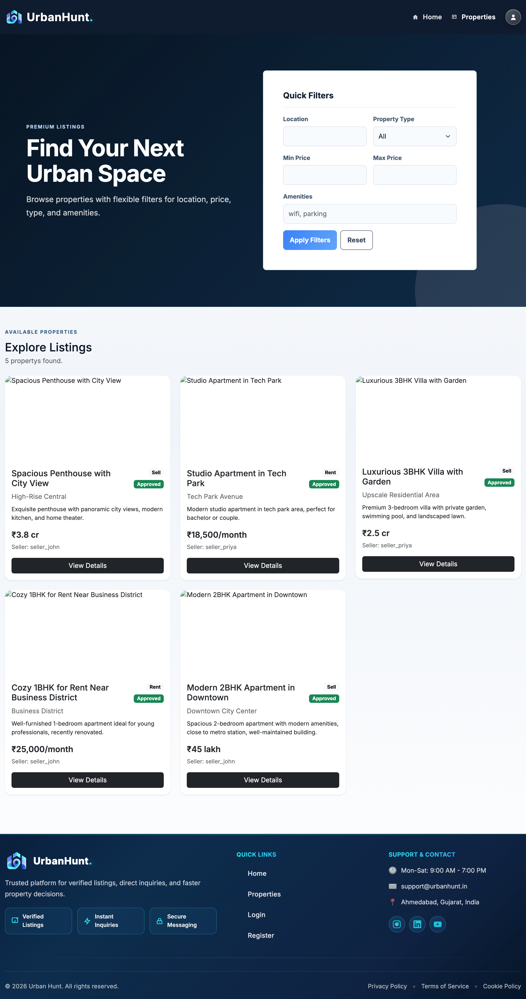

# Urban Hunt

## Project Description

Urban Hunt is a lightweight Django-based real estate marketplace for buyers and sellers. This README uses a concise, flow-based structure and only references available screenshots.

## Project Features

- **User Roles:** Buyer, Seller, and Admin with role-based access.
- **Property Listings:** Create and browse listings with images and documents.
- **Inquiry & Chat:** Buyers can inquire and chat with sellers.
- **Saved Properties:** Users can bookmark favorites.
- **Admin Tools:** Approve listings and manage users.

## Setup Commands

```bash
# Clone the repository
git clone https://github.com/brainybeamGit/Urban_Hunt_Py.git

# Navigate to project directory
cd Urban_Hunt_Py
ls  # Verify manage.py is present

# Create virtual environment (macOS/Linux)
python3 -m venv .venv

# Activate virtual environment (macOS/Linux)
source .venv/bin/activate

# Install dependencies
pip install -r requirements.txt

# Copy environment variables (optional)
cp .env.sample .env
# Edit .env and fill in SECRET_KEY and email settings

# Run database migrations
python manage.py migrate

# Populate the database with seed data
python manage.py shell < seeds.py

# Run development server
python manage.py runserver
```

## Default Server

- **Local Server:** `http://localhost:8000`

## Admin Credentials

| Field    | Value             |
|----------|-------------------|
| Username | `admin`           |
| Email    | `admin@gmail.com` |
| Password | `admin`           |

## Test User Credentials

| Role   | Username        | Password      |
|--------|-----------------|---------------|
| Seller | `seller_john`   | `seller123`   |
| Seller | `seller_priya`  | `seller123`   |
| Buyer  | `buyer_amit`    | `buyer123`    |

## Screenshots (available)

### 1. Home Page


### 2. Login Page


### 3. Properties Listing


```
python manage.py migrate
python manage.py shell < seeds.py
```

## License

This project is part of the Urban Hunt platform.

## Support

For issues or questions, contact the development team.
